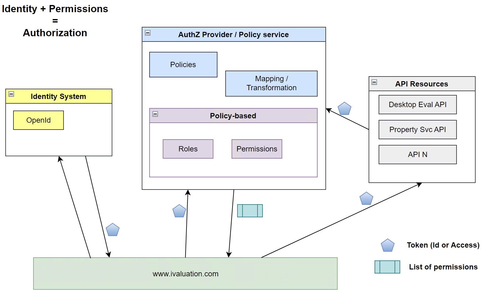
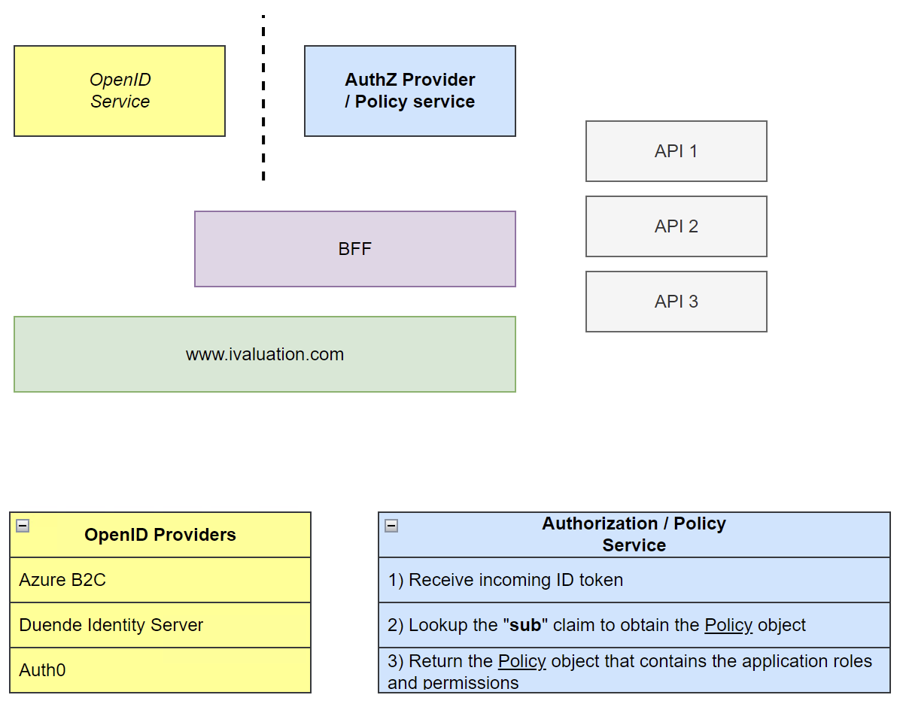

# Policy-based Authorization Demo

## Intro
This demo exemplified the separation of concerns of `authentication` and `authorization`. The same way you centralize the authentication to an `Identity Provider`, you should do the same for an `Authorization Provider`.

The scenario presented is on a common use case for iVal, as defined in the `Role Based Matrix.xls`.

### Identity + Permissions = Authorization

### AuthZ Policy-based service

## Conceptual Model - Semantics and Tuples

1. `Users` namespace
1. App-specific `Roles` namespace
1. App-specific `Permissions` namespace
1. **Policy-based** mapping of `Roles` and `Permissions`

### `Users` namespace

#### Tuples example:

|Tenant Id|User Id (sub claim)|Name|Email|Identity Role (IDP claim)|
|:-:|:-:|-|-|-|
|Tenant A|`1`|Alice|alice@tenantA.com|Operations Manager|
|Tenant A|`2`|Bob|bob@tenantA.com|PO|
|Tenant A|`3`|Eve|eve@tenantA.com|Customer Svc Specialist|
|Tenant B|`11`|Mallory|mallory@tenantB.com|Accounts Specialist Contractor|

#### Semantics: example

1. The user `Alice` with a **user id** `1`, has an *identity role* of `Operations Manager` in `Tenant A`.
1. The user `Bob` with a **user id** `2`, has an *identity role* of `PO` in `Tenant A`.
1. The user `Eve` with a **user id** `3`, has an *identity role* of `Customer Svc Specialist` in `Tenant A`.
1. The user `Mallory` with a **user id** `11`, has an *identity role* of `Accounts Specialist Contractor` in `Tenant B`.

### Application-specific `Roles` namespace

#### Tuples example:

|User Id(s)|User(s)|App-specific Role|AuthZ Policy Application|
|:-|:-|:-:|-|
|[`1`]|Alice|Owners| Web App 1  Policy|
|[`2`,`3`]|Bob, Eve|Contributors|Web App 1 Policy|
|[`11`]|Mallory|Viewers|Web App 1 Policy|

#### Semantics:

1. The authorization policy `Web App1 Policy` has a role named `Owners` which maps to users: [`Alice`]
1. The authorization policy `Web App1 Policy` has a role named `Contributors` which maps to users: [`Bob`, `Eve`]
1. The authorization policy `Web App1 Policy` has a role named `Viewers` which maps to users: [`Mallory`]

### Application-specific `Permissions` namespace

#### Tuples example:

||Permissions (operations allowed in the app)|App-specific Role(s)|
|-|-|-|
|1|CanCreateOrUpdateOrder|Owners, Contributors|
|2|CanViewOrder|Owners, Contributors, Viewers|
|3|CanShareOrder|Owners|
|4|CanExportToPDF|Owners, Viewers|
|5|CanRemove...|-|

#### Semantics:

1. All users belonging to the role `Owners` can:
    1. `CanCreateOrUpdateOrder`
    1. `CanViewOrder`
    1. `CanShareOrder`
    1. `CanExportToPDF`
1. All users belonging to the role `Contributors` can:
    1. `CanCreateOrUpdateOrder`
    1. `CanViewOrder`
1. All users belonging to the role `Viewers` can:
    1. `CanViewOrder`
    1. `CanExportToPDF`
1. All users belonging to the role `?` can:
    1. `CanRemove...`

### **Policy-based** mapping of `Roles` and `Permissions`

A policy models the application authorization requirements.

#### Tuples example for `Web App 1 Policy`:

||Roles||Owners|Contributors|Viewers|
|-:|:-|-|:-:|:-:|:-:|
|**Permissions**||CanCreateOrUpdateOrder|x|x|-|
|||CanViewOrder|x|x|x|
|||CanShareOrder|x|-|-|
|||CanExportToPDF|x|-|x|

#### Semantics:

1. In the `Web App 1 Policy`, all users in role `Owners` are allowed execute:
    - [`CanCreateOrUpdateOrder`, `CanViewOrder`, `CanShareOrder`, `CanExportToPDF`]
1. In the `Web App 1 Policy`, all users in role `Contributors` are allowed execute:
    - [`CanCreateOrUpdateOrder`, `CanViewOrder`]
1. In the `Web App 1 Policy`, all users in role `Viewers` are allowed execute:
    - [`CanViewOrder`, `CanExportToPDF`]

In other words, the `Web App 1 Policy` defines that:

1. `Alice` from `Tenant A` has the role `Owner` and is allowed to  [`CanCreateOrUpdateOrder`, `CanViewOrder`, `CanShareOrder`, `CanExportToPDF`]
1. `Bob` and `Eve` from `Tenant A` have the role `Contributor` and are allowed to [`CanCreateOrUpdateOrder`, `CanViewOrder`]
1. `Eve` from `Tenant B` has the role of `Viewer` and is allowed to [`CanViewOrder`, `CanExportToPDF`]